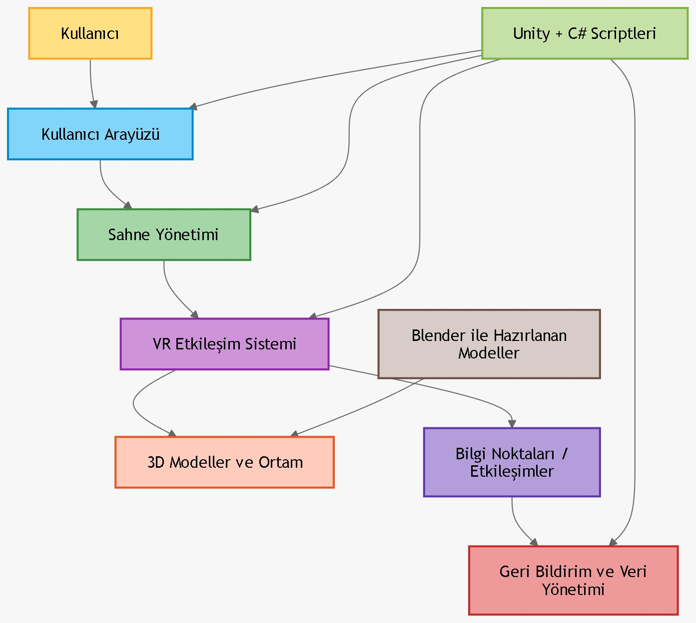

# Mimari Tasarım Dokümanı

## 1. Amaç

Bu doküman, **Sanal Şehir Keşfi** projesinin genel yazılım mimarisini tanımlamak amacıyla hazırlanmıştır. Projede kullanılacak teknolojiler, ana modüller, modüller arası ilişki, veri akışı ve önerilen klasör yapısı bu dokümanda açıklanmıştır.

Bu mimari tasarımın amacı, geliştirme sürecini daha planlı ve düzenli hale getirmek, ekip içi görev dağılımını kolaylaştırmak ve uygulamanın sürdürülebilir bir yapıda geliştirilmesini sağlamaktır.

---

## 2. Proje Özeti

Sanal Şehir Keşfi, kullanıcıların tarihi ve kültürel mekanları sanal gerçeklik ortamında gezebileceği, etkileşimli bir deneyim yaşayabileceği bir uygulamadır. Kullanıcılar sanal ortamda şehir içerisinde dolaşabilecek, belirli yapılar veya nesneler ile etkileşime girebilecek ve uygulama sonunda deneyimlerine ilişkin geri bildirim verebilecektir.

---

## 3. Kullanılacak Teknolojiler

Projede kullanılacak temel teknolojiler aşağıdaki gibidir:

- **Unity**
  - Uygulamanın ana geliştirme ortamı olarak kullanılacaktır.
  - 3D sahne yönetimi, kullanıcı etkileşimi ve VR desteği için uygundur.

- **C#**
  - Unity içerisinde script geliştirmek için kullanılacaktır.
  - Oyun mantığı, kullanıcı etkileşimleri ve sistem kontrolleri bu dil ile geliştirilecektir.

- **Blender**
  - 3D modelleme işlemlerinde kullanılacaktır.
  - Sanal şehirde yer alacak bina, obje ve çevresel modeller burada hazırlanacaktır.

- **Oculus SDK / VR Entegrasyonu**
  - VR cihaz desteği ve kullanıcı etkileşimlerinin sağlanması amacıyla kullanılacaktır.

- **Git / GitHub**
  - Sürüm kontrolü, ekip çalışması ve proje takibi için kullanılacaktır.

---

## 4. Mimari Yaklaşım

Proje, **modüler bir mimari** ile geliştirilecektir. Her ana işlev ayrı bir modül halinde planlanacaktır. Bu sayede:

- Kod okunabilirliği artacaktır.
- Takım üyeleri farklı alanlarda paralel çalışabilecektir.
- Hata ayıklama ve bakım süreçleri kolaylaşacaktır.
- Yeni özellik eklemek daha düzenli hale gelecektir.

Bu proje için uygun görülen mimari yaklaşım, Unity merkezli ve bileşen bazlı bir yapıdır. Uygulama; kullanıcı arayüzü, sahne yönetimi, VR etkileşimleri, model entegrasyonu ve veri/geri bildirim yönetimi gibi alt bileşenlerden oluşacaktır.

---

## 5. Ana Modüller

### 5.1. Kullanıcı Arayüzü (UI) Modülü

Bu modül, kullanıcının uygulama ile doğrudan etkileşim kurduğu ekranları kapsar.

#### Sorumlulukları
- Ana menü ekranını göstermek
- Mekan veya bölüm seçimini sağlamak
- Bilgilendirme ekranlarını göstermek
- Geri bildirim ve yönlendirme ekranlarını sunmak

#### Örnek Bileşenler
- Başlangıç menüsü
- Sahne seçim ekranı
- Bilgi paneli
- Deneyim sonu geri bildirim ekranı

---

### 5.2. Sahne Yönetimi Modülü

Bu modül, uygulamadaki sahnelerin yüklenmesi, değiştirilmesi ve yönetilmesinden sorumludur.

#### Sorumlulukları
- Seçilen mekanın sahnesini yüklemek
- Sahne geçişlerini kontrol etmek
- Uygulama akışına göre doğru içeriği göstermek

#### Örnek İşlevler
- Ana menüden gezi sahnesine geçiş
- Farklı mekanların ayrı sahneler olarak yönetilmesi
- Performans için gerekli yükleme düzenlemeleri

---

### 5.3. VR Etkileşim Modülü

Bu modül, kullanıcı ile sanal ortam arasındaki etkileşimi yönetir.

#### Sorumlulukları
- Kamera ve kullanıcı bakış açısını yönetmek
- Hareket ve gezinme işlemlerini kontrol etmek
- VR kontrol cihazları ile etkileşimi sağlamak
- Nesnelere yaklaşma, seçme veya inceleme gibi işlemleri gerçekleştirmek

#### Örnek İşlevler
- Kullanıcının sanal ortamda dolaşması
- Belirli objelere odaklanma
- Bilgi noktaları ile etkileşim

---

### 5.4. 3D Model ve Varlık Yönetimi Modülü

Bu modül, Blender ile hazırlanan modellerin Unity içerisine aktarılması ve kullanılmasını kapsar.

#### Sorumlulukları
- 3D modellerin sisteme entegre edilmesi
- Şehir öğelerinin sahneye yerleştirilmesi
- Performans açısından uygun model kullanımının sağlanması
- Doku, materyal ve çevresel bileşenlerin düzenlenmesi

#### Örnek İçerikler
- Tarihi yapılar
- Kültürel mekanlar
- Yollar, çevre öğeleri ve yönlendirme unsurları

---

### 5.5. Veri Yönetimi ve Geri Bildirim Modülü

Bu modül, kullanıcıdan alınan geri bildirimleri, test verilerini veya uygulama içi kayıtları yönetir.

#### Sorumlulukları
- Kullanıcı geri bildirimlerini toplamak
- Test sonuçlarını kaydetmek
- İleride gerekirse kullanıcı etkileşim istatistiklerini tutmak

#### Not
İlk sürümde veri yapısı basit tutulabilir. İhtiyaca göre daha sonra geliştirilebilir.

---

## 6. Modüller Arası İlişki

Projede modüller birbiriyle bağlantılı çalışacaktır. Genel ilişki aşağıdaki gibidir:

- Kullanıcı, **UI modülü** üzerinden seçim yapar.
- Seçime göre **Sahne Yönetimi modülü** ilgili sahneyi yükler.
- Yüklenen sahnede **VR Etkileşim modülü** aktif hale gelir.
- Sahne içerisindeki içerikler **3D Model Yönetimi modülü** tarafından sağlanır.
- Kullanıcı deneyimi sonunda alınan bilgiler **Veri Yönetimi ve Geri Bildirim modülü** tarafından işlenir.

---

## 7. Veri Akışı

Sistemin temel veri akışı aşağıdaki şekilde planlanmıştır:

1. Kullanıcı uygulamayı başlatır.
2. Ana menü ekranı açılır.
3. Kullanıcı bir mekan veya gezi alanı seçer.
4. Seçilen içeriğe göre ilgili sahne yüklenir.
5. Kullanıcı VR ortamında dolaşır ve etkileşim kurar.
6. Sistem kullanıcı hareketlerini ve seçimlerini yönetir.
7. Deneyim sonunda kullanıcıdan geri bildirim alınır.
8. Gerekli bilgiler kayıt altına alınır.

---

## 8. Basit Mimari Şema

```text
Kullanıcı
   |
   v
Kullanıcı Arayüzü (UI)
   |
   v
Sahne Yönetimi
   |
   v
VR Etkileşim Sistemi
   |
   v
3D Modeller / Ortam
   |
   v
Geri Bildirim ve Veri Yönetimi
```

---

## 9. Önerilen Klasör Yapısı

```text
Assets/
│
├── Scenes/
│   ├── MainMenu
│   ├── CityScene
│   └── FeedbackScene
│
├── Scripts/
│   ├── UI/
│   ├── Managers/
│   ├── VR/
│   ├── Data/
│   └── Interaction/
│
├── Models/
│   ├── Buildings/
│   ├── Objects/
│   └── Environment/
│
├── Materials/
├── Prefabs/
├── UI/
└── Resources/
```

### Klasör Açıklamaları

- **Scenes/**: Uygulamadaki sahneleri içerir.
- **Scripts/UI/**: Menü ve arayüz ile ilgili scriptler burada bulunur.
- **Scripts/Managers/**: Sahne yönetimi ve genel kontrol sınıfları burada yer alır.
- **Scripts/VR/**: VR hareket, kamera ve cihaz etkileşim kodları burada bulunur.
- **Scripts/Data/**: Veri yönetimi ve geri bildirim kayıtları burada yer alır.
- **Models/**: Blender’dan aktarılan 3D varlıklar burada tutulur.
- **Prefabs/**: Tekrar kullanılabilir Unity nesneleri burada bulunur.

---

## 10. Mimari Tasarım Kararları

Bu mimari yapı seçilirken aşağıdaki kriterler dikkate alınmıştır:

- Projenin VR tabanlı olması
- Unity’nin bileşen tabanlı yapısına uygun geliştirme ihtiyacı
- Ekip üyelerinin farklı alanlarda görev alacak olması
- Modüler ve geliştirilebilir bir sistem ihtiyacı
- İleride yeni mekan, yeni etkileşim veya yeni ekran ekleme ihtimali

---

## 11. Beklenen Avantajlar

Bu mimari yapının sağlayacağı başlıca avantajlar şunlardır:

- Kod karmaşasının azaltılması
- Görevlerin ekip üyeleri arasında daha kolay paylaşılması
- Geliştirme sürecinin daha planlı ilerlemesi
- Hata bulma ve düzeltme sürecinin kolaylaşması
- İlerleyen haftalarda yeni özellik eklenmesinin kolay olması

---

## 12. Sonuç

Sanal Şehir Keşfi projesi için önerilen bu mimari yapı, uygulamanın temel bileşenlerini net şekilde ayırmakta ve geliştirme sürecine rehberlik etmektedir. Bu yapı sayesinde proje daha düzenli, sürdürülebilir ve ekip çalışmasına uygun biçimde geliştirilebilecektir.

Bu doküman, proje ilerledikçe güncellenebilir ve yeni ihtiyaçlara göre genişletilebilir.

---

## 🖼️ Diyagram Burada

Aşağıda mimari tasarım diyagramı yer almaktadır:


