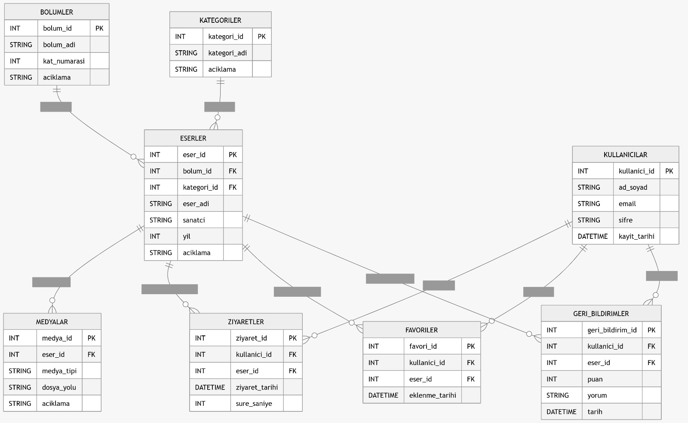

# Veritabanı Tasarımı Dokümanı

## 1. Amaç

Bu doküman, **Sanal Şehir Keşfi** projesi için hazırlanan veritabanı tasarımını açıklamak amacıyla düzenlenmiştir. Veritabanı yapısı, paylaşılan ER diyagramına göre güncellenmiş ve tablolar, alanlar, ilişkiler ile örnek SQL şeması bu dokümanda bir araya getirilmiştir.

Bu tasarımın amacı; uygulamada yer alan eserleri, bölümleri, kategorileri, kullanıcı işlemlerini, ziyaret kayıtlarını, favorileri, geri bildirimleri ve medya içeriklerini düzenli bir yapıda saklamaktır.

---

## 2. Veritabanı Yaklaşımı

Projede ilişkisel veritabanı yapısı kullanılacaktır. Bu yaklaşım sayesinde:

- Veriler tablo bazlı düzenli şekilde tutulabilir.
- Tablolar arası ilişkiler açık biçimde tanımlanabilir.
- Veri tekrarının önüne geçilebilir.
- Uygulama büyüdükçe yeni tablolar ve alanlar eklemek kolaylaşır.

Bu yapı; **SQLite**, **MySQL** veya **PostgreSQL** üzerinde uygulanabilir. Prototip aşamasında SQLite uygun bir tercih olabilir.

---

## 3. Genel Yapı

ER diyagramına göre sistemin merkezinde **ESERLER** tablosu bulunmaktadır. Bölümler ve kategoriler eserleri sınıflandırırken; kullanıcılar eserleri ziyaret edebilir, favorilere ekleyebilir ve geri bildirim bırakabilir. Ayrıca eserlerle ilişkili medya kayıtları da sistemde tutulur.

---

## 4. Tablolar

## 4.1. BOLUMLER

Bu tablo, eserlerin bulunduğu bölüm bilgilerini tutar.

| Alan Adı | Veri Tipi | Açıklama |
|---|---|---|
| bolum_id | INT | Birincil anahtar |
| bolum_adi | STRING | Bölüm adı |
| kat_numarasi | INT | Kat numarası |
| aciklama | STRING | Bölüm açıklaması |

### Açıklama
Her eser bir bölüme bağlıdır. Örneğin bir müze yapısında farklı katlar veya sergi alanları bu tabloda tutulabilir.

---

## 4.2. KATEGORILER

Bu tablo, eserlerin kategorilerini tutar.

| Alan Adı | Veri Tipi | Açıklama |
|---|---|---|
| kategori_id | INT | Birincil anahtar |
| kategori_adi | STRING | Kategori adı |
| aciklama | STRING | Kategori açıklaması |

### Açıklama
Eserlerin türlerine göre sınıflandırılması için kullanılır.

---

## 4.3. ESERLER

Bu tablo, sistemdeki ana içerikleri yani eserleri tutar.

| Alan Adı | Veri Tipi | Açıklama |
|---|---|---|
| eser_id | INT | Birincil anahtar |
| bolum_id | INT | BOLUMLER tablosuna yabancı anahtar |
| kategori_id | INT | KATEGORILER tablosuna yabancı anahtar |
| eser_adi | STRING | Eser adı |
| sanatci | STRING | Eseri oluşturan sanatçı |
| yil | INT | Eser yılı |
| aciklama | STRING | Eser açıklaması |

### Açıklama
Bu tablo veritabanının temel tablosudur. Eserlerin hangi bölümde bulunduğu ve hangi kategoriye ait olduğu buradan takip edilir.

---

## 4.4. MEDYALAR

Bu tablo, eserlerle ilişkili medya dosyalarını tutar.

| Alan Adı | Veri Tipi | Açıklama |
|---|---|---|
| medya_id | INT | Birincil anahtar |
| eser_id | INT | ESERLER tablosuna yabancı anahtar |
| medya_tipi | STRING | Medya türü |
| dosya_yolu | STRING | Dosya yolu |
| aciklama | STRING | Medya açıklaması |

### Açıklama
Eserlere ait görsel, ses veya video içerikleri burada saklanabilir.

### Örnek Medya Türleri
- gorsel
- ses
- video
- 3d_model

---

## 4.5. KULLANICILAR

Bu tablo, uygulamayı kullanan kullanıcıların temel bilgilerini tutar.

| Alan Adı | Veri Tipi | Açıklama |
|---|---|---|
| kullanici_id | INT | Birincil anahtar |
| ad_soyad | STRING | Kullanıcının adı soyadı |
| email | STRING | E-posta adresi |
| sifre | STRING | Kullanıcı şifresi |
| kayit_tarihi | DATETIME | Kayıt tarihi |

### Not
Gerçek uygulamada `sifre` alanı düz metin tutulmamalı, şifre hash olarak saklanmalıdır.

---

## 4.6. ZIYARETLER

Bu tablo, kullanıcıların hangi eseri ne zaman ziyaret ettiğini tutar.

| Alan Adı | Veri Tipi | Açıklama |
|---|---|---|
| ziyaret_id | INT | Birincil anahtar |
| kullanici_id | INT | KULLANICILAR tablosuna yabancı anahtar |
| eser_id | INT | ESERLER tablosuna yabancı anahtar |
| ziyaret_tarihi | DATETIME | Ziyaret zamanı |
| sure_saniye | INT | Eserde geçirilen süre |

### Açıklama
Kullanıcıların eserlerle etkileşim süresi ve ziyaret geçmişi bu tabloda izlenebilir.

---

## 4.7. FAVORILER

Bu tablo, kullanıcıların favorilere eklediği eserleri tutar.

| Alan Adı | Veri Tipi | Açıklama |
|---|---|---|
| favori_id | INT | Birincil anahtar |
| kullanici_id | INT | KULLANICILAR tablosuna yabancı anahtar |
| eser_id | INT | ESERLER tablosuna yabancı anahtar |
| eklenme_tarihi | DATETIME | Favorilere eklenme tarihi |

### Açıklama
Kullanıcıların beğendiği veya daha sonra tekrar incelemek istediği eserler burada tutulur.

---

## 4.8. GERI_BILDIRIMLER

Bu tablo, kullanıcıların eserler hakkında verdiği puan ve yorumları tutar.

| Alan Adı | Veri Tipi | Açıklama |
|---|---|---|
| geri_bildirim_id | INT | Birincil anahtar |
| kullanici_id | INT | KULLANICILAR tablosuna yabancı anahtar |
| eser_id | INT | ESERLER tablosuna yabancı anahtar |
| puan | INT | Kullanıcının verdiği puan |
| yorum | STRING | Kullanıcı yorumu |
| tarih | DATETIME | Geri bildirim tarihi |

### Açıklama
Bu tablo, kullanıcı memnuniyeti ve eser değerlendirmeleri için kullanılacaktır.

---

## 5. Tablolar Arası İlişkiler

ER diyagramına göre temel ilişkiler şunlardır:

- Bir **bölüm**, birden fazla **esere** sahip olabilir.
- Bir **kategori**, birden fazla **esere** sahip olabilir.
- Bir **eser**, birden fazla **medya** kaydına sahip olabilir.
- Bir **kullanıcı**, birden fazla **ziyaret** kaydına sahip olabilir.
- Bir **eser**, birden fazla **ziyaret** kaydına sahip olabilir.
- Bir **kullanıcı**, birden fazla **favori** kaydına sahip olabilir.
- Bir **eser**, birden fazla **favori** kaydına sahip olabilir.
- Bir **kullanıcı**, birden fazla **geri bildirim** bırakabilir.
- Bir **eser**, birden fazla **geri bildirim** alabilir.

---

## 6. ER Diyagramına Göre Şema Özeti

Aşağıdaki tablolar kullanılacaktır:

- **BOLUMLER**
- **KATEGORILER**
- **ESERLER**
- **MEDYALAR**
- **KULLANICILAR**
- **ZIYARETLER**
- **FAVORILER**
- **GERI_BILDIRIMLER**

Bu yapı ile hem içerik yönetimi hem de kullanıcı işlemleri aynı veritabanı içerisinde düzenli olarak tutulabilir.

---

## 7. Örnek SQL Şeması

```sql
CREATE TABLE bolumler (
    bolum_id INTEGER PRIMARY KEY AUTOINCREMENT,
    bolum_adi VARCHAR(100) NOT NULL,
    kat_numarasi INTEGER,
    aciklama VARCHAR(255)
);

CREATE TABLE kategoriler (
    kategori_id INTEGER PRIMARY KEY AUTOINCREMENT,
    kategori_adi VARCHAR(100) NOT NULL,
    aciklama VARCHAR(255)
);

CREATE TABLE eserler (
    eser_id INTEGER PRIMARY KEY AUTOINCREMENT,
    bolum_id INTEGER NOT NULL,
    kategori_id INTEGER NOT NULL,
    eser_adi VARCHAR(150) NOT NULL,
    sanatci VARCHAR(100),
    yil INTEGER,
    aciklama VARCHAR(255),
    FOREIGN KEY (bolum_id) REFERENCES bolumler(bolum_id),
    FOREIGN KEY (kategori_id) REFERENCES kategoriler(kategori_id)
);

CREATE TABLE medyalar (
    medya_id INTEGER PRIMARY KEY AUTOINCREMENT,
    eser_id INTEGER NOT NULL,
    medya_tipi VARCHAR(50) NOT NULL,
    dosya_yolu VARCHAR(255) NOT NULL,
    aciklama VARCHAR(255),
    FOREIGN KEY (eser_id) REFERENCES eserler(eser_id)
);

CREATE TABLE kullanicilar (
    kullanici_id INTEGER PRIMARY KEY AUTOINCREMENT,
    ad_soyad VARCHAR(100) NOT NULL,
    email VARCHAR(100) UNIQUE NOT NULL,
    sifre VARCHAR(255) NOT NULL,
    kayit_tarihi DATETIME DEFAULT CURRENT_TIMESTAMP
);

CREATE TABLE ziyaretler (
    ziyaret_id INTEGER PRIMARY KEY AUTOINCREMENT,
    kullanici_id INTEGER NOT NULL,
    eser_id INTEGER NOT NULL,
    ziyaret_tarihi DATETIME DEFAULT CURRENT_TIMESTAMP,
    sure_saniye INTEGER,
    FOREIGN KEY (kullanici_id) REFERENCES kullanicilar(kullanici_id),
    FOREIGN KEY (eser_id) REFERENCES eserler(eser_id)
);

CREATE TABLE favoriler (
    favori_id INTEGER PRIMARY KEY AUTOINCREMENT,
    kullanici_id INTEGER NOT NULL,
    eser_id INTEGER NOT NULL,
    eklenme_tarihi DATETIME DEFAULT CURRENT_TIMESTAMP,
    FOREIGN KEY (kullanici_id) REFERENCES kullanicilar(kullanici_id),
    FOREIGN KEY (eser_id) REFERENCES eserler(eser_id)
);

CREATE TABLE geri_bildirimler (
    geri_bildirim_id INTEGER PRIMARY KEY AUTOINCREMENT,
    kullanici_id INTEGER NOT NULL,
    eser_id INTEGER NOT NULL,
    puan INTEGER CHECK (puan >= 1 AND puan <= 5),
    yorum VARCHAR(255),
    tarih DATETIME DEFAULT CURRENT_TIMESTAMP,
    FOREIGN KEY (kullanici_id) REFERENCES kullanicilar(kullanici_id),
    FOREIGN KEY (eser_id) REFERENCES eserler(eser_id)
);
```

---

## 8. Tasarım Kararları

Bu veritabanı yapısı oluşturulurken şu kararlar dikkate alınmıştır:

- Eserler merkezi tablo olarak tasarlanmıştır.
- Bölüm ve kategori bilgileri ayrı tutulmuştur.
- Medya içerikleri eserlerden ayrılarak çoklu medya desteği sağlanmıştır.
- Kullanıcı işlemleri ziyaret, favori ve geri bildirim olarak ayrı tablolarda saklanmıştır.
- Tasarım sade ama genişletilebilir olacak şekilde hazırlanmıştır.

---

## 9. Geliştirme Önerileri

İlerleyen aşamalarda aşağıdaki geliştirmeler eklenebilir:

- Rol bazlı kullanıcı sistemi
- Yönetici paneli için `admins` tablosu
- Eser puan ortalaması için özet tablo
- Kullanıcı başarımları
- Geçmiş aktiviteler için log tablosu

---

## 10. Sonuç

Bu veritabanı tasarımı, paylaşılan ER diyagramına uygun şekilde güncellenmiştir. Sistem; eserler, bölümler, kategoriler, medya kayıtları, kullanıcı işlemleri ve geri bildirimler etrafında yapılandırılmıştır.

Bu yapı, Sanal Şehir Keşfi projesinin ilk sürümü için yeterli bir temel sunmakta ve ilerleyen aşamalarda geliştirilmeye uygun bir veritabanı altyapısı oluşturmaktadır.

---

## 🖼️ Diyagram Burada

Aşağıda veritabanı tasarım diyagramı yer almaktadır:


