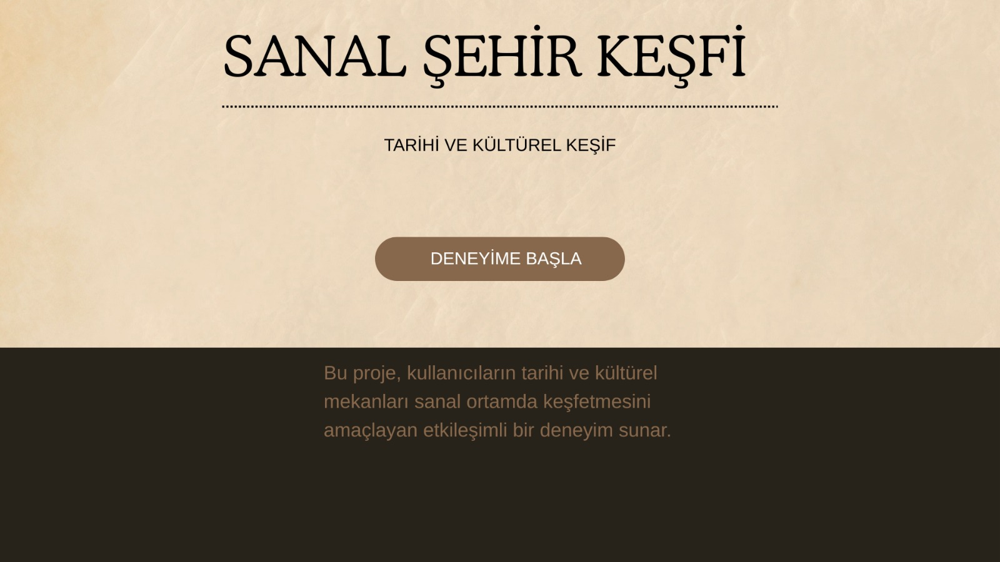
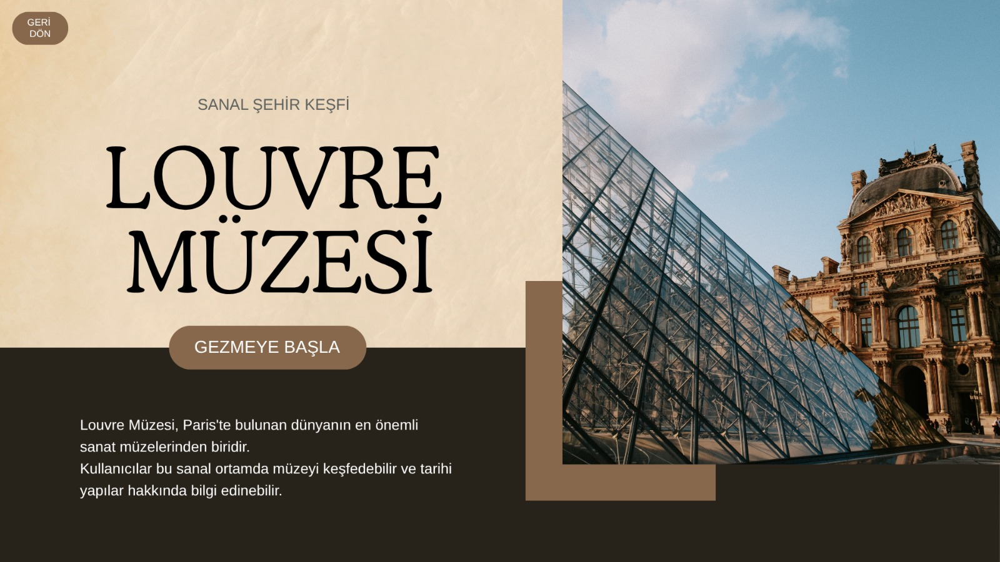
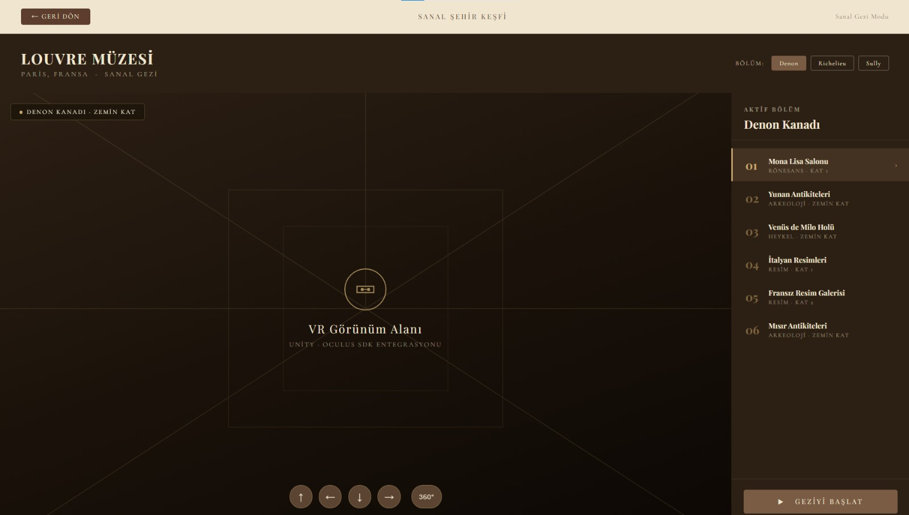
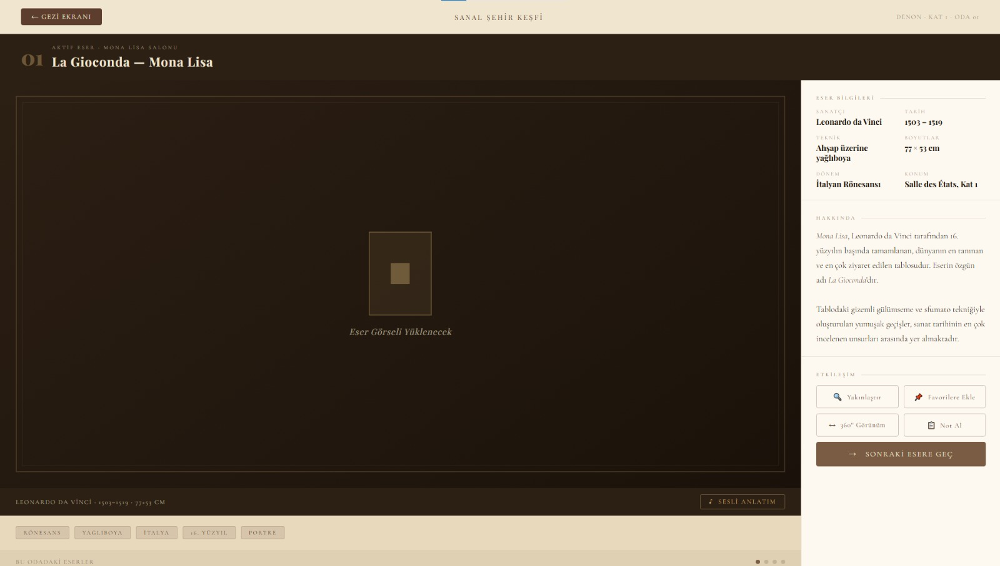

# 📊 Proje Akışı

Bu dosya, **“Sanal Gerçeklik Simülatörleri”** takımının haftalık proje ilerlemesini ve üyelerin görev dağılımlarını içermektedir.  
Her hafta ekip üyeleri yaptıkları çalışmaları bu dosyaya ekleyerek projenin gelişimini takip edecektir.

---

# 📅 1. Hafta (6 – 12 Mart)

## 👨‍💼 Mehmet Talha Kaya (Scrum Master / Proje Yöneticisi)
- GitHub reposu oluşturuldu.
- `main` branch için branch koruma kuralları ayarlandı.
- Takım üyeleri repo’ya collaborator olarak eklendi.
- GitHub Desktop ve Git iş akışı hakkında ekip bilgilendirildi.
- Proje akışı dokümanı (**projeakisi.md**) oluşturuldu.

---

## 🛠️ Melike Gücin (Proje Yönetimi ve İşbirliği Araçları)
- Proje yönetimi ve görev takibi için kullanılabilecek araçlar incelendi.
- GitHub üzerinden ekip iş akışı planlandı.
- Proje görevlerinin takibi için pano sistemi hazırlandı.

---

## 📋 Mustafa Murat Hilaloğlu (Gereksinim Analizi)
- Proje için kullanıcı ve sistem gereksinimleri araştırıldı.
- Sanal şehir keşfi uygulamasının temel özellikleri belirlendi.
- Gereksinim dokümanı için taslak hazırlandı.

---

## 🔎 Mehmet Talha Kaya (Teknoloji Araştırması)
- Projede kullanılabilecek teknolojiler araştırıldı.
- Unity, C#, Blender ve Oculus SDK araçları incelendi.
- VR simülasyon projeleri için uygun geliştirme araçları değerlendirildi.

---

## ⚠️ Mehmet Talha Kaya (Risk Analizi)
- Proje sürecinde ortaya çıkabilecek teknik ve organizasyonel riskler belirlendi.
- VR teknolojileri, yazılım araçları ve ekip koordinasyonu ile ilgili olası riskler değerlendirildi.
- Bu risklere karşı alınabilecek önlemler ve çözüm önerileri planlandı.

---

## ⚙️ Cemre Yurtsever (Geliştirme Ortamı Kurulumu)
- Projede kullanılacak geliştirme ortamı ve yazılım araçları araştırıldı.
- Unity oyun motoru ve gerekli geliştirme araçlarının kurulumu gerçekleştirildi.
- Projede kullanılacak bağımlılıklar (Unity, Visual Studio, Blender ve Oculus SDK) belirlendi ve ortam yapılandırması hazırlandı.
- Geliştirme sürecinin sorunsuz ilerleyebilmesi için temel proje ortamları oluşturuldu.
---

## 📊 Fırat Seçkin (Proje Analizi ve Kapsam Belirleme)
- Projenin temel amacı ve hedef kullanıcı kitlesi belirlendi.
- Sanal şehir keşfi uygulamasının kapsamı tanımlandı.
- Proje vizyonu ve genel işlevleri üzerine analiz yapıldı.

---

# ✅ 1. Hafta Gerçekleştirilen Çalışmalar

## 🔎 Teknoloji Araştırması ve Değerlendirme
**Sorumlu:** Mehmet Talha Kaya

Proje kapsamında kullanılabilecek **VR teknolojileri, yazılım geliştirme araçları ve hareket izleme sistemleri** araştırılmış ve **maliyet, performans ve uyumluluk** kriterlerine göre değerlendirilmiştir.

### 🕶 VR Başlıkları

| Cihaz | Avantaj | Dezavantaj |
|------|---------|-----------|
| **Meta Quest / Oculus Quest** | Kablosuz kullanım, uygun maliyet, Unity ile uyumlu | Grafik gücü sınırlı |
| **HTC Vive** | Yüksek doğrulukta hareket takibi | Yüksek maliyet ve kurulum gereksinimi |

📌 **Sonuç:** Öğrenci projesi için **Meta Quest tabanlı VR sistemleri** daha uygun görülmüştür.

---

### 🖐 Hareket İzleme Sistemleri

- **Inside-Out Tracking:** Sensörler headset üzerinde bulunur (Quest).
- **External Tracking:** Harici sensörlerle takip yapılır (HTC Vive).
- **El Takibi:** Leap Motion gibi sistemlerle el hareketleri algılanabilir.

📌 Bu sistemler kullanıcının **baş ve el hareketlerini sanal ortama aktararak gerçekçi etkileşim sağlar.**

---

### 💻 Yazılım Geliştirme Araçları

| Araç | Amaç |
|-----|------|
| **Unity** | VR ortamı ve 3D sahne geliştirme |
| **C#** | Unity içinde programlama |
| **Blender** | 3D model düzenleme |
| **Oculus SDK / OpenVR** | VR cihaz entegrasyonu |

📌 **Sonuç:** Projede **Unity + C# + Oculus SDK** kullanılması planlanmıştır.

---

## ⚠️ Risk Analizi
**Sorumlu:** Mehmet Talha Kaya

Proje geliştirme sürecinde ortaya çıkabilecek teknik ve organizasyonel riskler belirlenmiş ve bu risklere karşı alınabilecek önlemler planlanmıştır.

### 📉 Olası Riskler

| Risk | Açıklama |
|-----|----------|
| 💻 Teknik Problemler | Unity veya yazılım araçlarında hata oluşması |
| 🧱 Model Uyumsuzluğu | 3D modellerin performans sorunu yaratması |
| 🕶 Donanım Sorunu | VR cihazının bulunmaması |
| 👥 İletişim Problemi | Ekip içi koordinasyon eksikliği |
| ⏱ Zaman Yönetimi | Görevlerin gecikmesi |

### 🛠 Alınacak Önlemler

- Unity ile uyumlu **low-poly modeller** kullanılacaktır.  
- Proje **GitHub üzerinden düzenli yedeklenecektir.**  
- Görevler **haftalık olarak planlanacaktır.**  
- Ekip iletişimi **GitHub ve proje panosu üzerinden sağlanacaktır.**

---

## 🛠 Proje Yönetimi ve İşbirliği Araçları Kurulumu  
**Sorumlu:** Melike Gücin  

Proje sürecinde ekip içi koordinasyonu sağlamak ve görev takibini kolaylaştırmak amacıyla proje yönetimi ve işbirliği araçları araştırılmış ve kurulmuştur.

### 📋 Proje Yönetim Araçları

| Araç | Amaç |
|-----|------|
| **Jira / Proje Panosu** | Görevlerin haftalık olarak planlanması ve takip edilmesi |
| **GitHub Issues** | Proje görevlerinin ve ilerlemenin kayıt altına alınması |

📌 Bu araçlar sayesinde ekip üyeleri görevlerini takip edebilmekte ve proje süreci düzenli bir şekilde yönetilebilmektedir.

---

### 🤝 İşbirliği Araçları

| Araç | Amaç |
|-----|------|
| **GitHub** | Proje kodlarının merkezi bir depoda tutulması |
| **Git** | Versiyon kontrolü ve ekip üyelerinin aynı proje üzerinde çalışabilmesi |
| **GitHub Desktop** | Git işlemlerinin görsel arayüz ile daha kolay yapılabilmesi |

📌 GitHub üzerinde proje deposu oluşturulmuş ve ekip üyeleri **collaborator** olarak eklenmiştir.

---

### 👥 Ekip Bilgilendirmesi

Ekip üyelerine aşağıdaki konularda kısa bir bilgilendirme yapılmıştır:

- GitHub reposunun kullanımı  
- Commit ve push işlemleri  
- Pull request oluşturma süreci  
- Proje panosu üzerinden görev takibi  

📌 Bu sayede ekip üyelerinin proje yönetim araçlarını etkin bir şekilde kullanması sağlanmıştır.

---

## Gereksinim Analizi

**Sorumlu:** Mustafa Murat Hilaloğlu

### Proje Tanımı
- Sanal Şehir Keşfi, kullanıcıların tarihi ve kültürel mekanları sanal gerçeklik (VR) ortamında etkileşimli olarak keşfetmesini sağlayan bir uygulamadır.
- Kullanıcılar VR gözlüğü aracılığıyla sanal şehir içerisinde dolaşabilir ve çeşitli mekanları inceleyebilir.
- Sistem, kullanıcıların tarihi yapılar hakkında bilgi almasını ve etkileşimli içeriklerle deneyimini zenginleştirmesini amaçlamaktadır.

### Proje Amaçları
- Tarihi ve kültürel mirası dijital ortamda tanıtmak.
- Kullanıcıya immersive (içine alan) bir VR deneyimi sunmak.
- VR teknolojisi aracılığıyla eğitim ve turizm alanlarına katkı sağlamak.
- Kullanıcıların etkileşimli ve görsel bir öğrenme deneyimi yaşamasını sağlamak.

### Fonksiyonel Gereksinimler
- Kullanıcı VR gözlüğü ile sanal şehir ortamına giriş yapabilmelidir.
- Kullanıcı sanal şehir içerisinde serbest şekilde dolaşabilmelidir.
- Kullanıcı şehirde bulunan tarihi yapılar ile etkileşime geçebilmelidir.
- Kullanıcı tarihi yapılar hakkında bilgi panellerini görüntüleyebilmelidir.
- Kullanıcı şehir içindeki farklı noktalara navigasyon sistemi ile ulaşabilmelidir.
- Sistem kullanıcıya görsel ve sesli bilgilendirme sunabilmelidir.

### Fonksiyonel Olmayan Gereksinimler
- Sistem VR ortamında akıcı bir deneyim sunmalıdır.
- Uygulama minimum 72 FPS performans ile çalışmalıdır.
- Sistem düşük gecikme süresi ile çalışmalıdır.
- Kullanıcı arayüzü anlaşılır ve kullanıcı dostu olmalıdır.
- Sistem farklı VR cihazları ile uyumlu çalışabilmelidir.

### Donanım Gereksinimleri
- VR gözlüğü (Oculus Quest 2, Oculus Quest 3 veya benzeri).
- VR kontrol cihazları.
- Minimum 16 GB RAM'e sahip bir bilgisayar.
- VR destekli ekran kartı (NVIDIA GTX 1060 veya üzeri).
- Motion tracking sensörleri.

### Yazılım Gereksinimleri
- Unity Game Engine (Unity 2021 LTS veya Unity 2022 LTS).
- Programlama dili olarak C#.
- 3D modelleme için Blender.
- VR entegrasyonu için Oculus SDK.
- Versiyon kontrol sistemi olarak Git.
- Kod geliştirme için Visual Studio.

### Kullanıcı Etkileşimleri
- Kullanıcı şehir içerisinde teleport veya joystick ile hareket edebilmelidir.
- Kullanıcı nesnelerle etkileşime geçebilmelidir.
- Kullanıcı bilgi panellerini aktive edebilmelidir.
- Kullanıcı şehir içerisindeki belirli noktalara navigasyon sistemi ile ulaşabilmelidir.

### Kullanıcı Arayüzü Gereksinimleri
- VR ortamına uygun 3D panel sistemi kullanılmalıdır.
- Menü sistemi kullanıcı tarafından kolay anlaşılabilir olmalıdır.
- Ana menüde başlat, şehir haritası, ayarlar, yardım ve çıkış seçenekleri bulunmalıdır.
- Arayüzde okunabilir büyük fontlar ve yüksek kontrast kullanılmalıdır.

### Performans Gereksinimleri
- Uygulama 72–90 FPS aralığında çalışmalıdır.
- Gecikme süresi 20 ms altında olmalıdır.
- Model ve sahneler performans açısından optimize edilmelidir.
- LOD sistemi ve occlusion culling gibi optimizasyon teknikleri kullanılmalıdır.

### Gelecek Geliştirmeler
- Multiplayer VR tur özelliği eklenmesi.
- Yapay zeka rehberi eklenmesi.
- Artırılmış gerçeklik (AR) entegrasyonu.
- Gerçek şehir verilerinin sisteme entegre edilmesi.

## 🗄️ Veritabanı Tasarımı
**👤 Sorumlu:** Mustafa Murat Hilaloğlu

Sanal Şehir Keşfi uygulamasında kullanılacak veritabanı şeması oluşturulmuştur. Hazırlanan ER diyagramı doğrultusunda tablolar, alanlar ve tablolar arası ilişkiler belirlenmiştir.

### 🔹 Belirlenen Tablolar
| Tablo | Amaç |
|------|------|
| **BOLUMLER** | Eserlerin bulunduğu bölüm bilgilerini tutmak |
| **KATEGORILER** | Eserleri türlerine göre sınıflandırmak |
| **ESERLER** | Sistemde yer alan ana içerikleri saklamak |
| **MEDYALAR** | Eserlere ait görsel, ses veya diğer medya kayıtlarını tutmak |
| **KULLANICILAR** | Kullanıcı bilgilerini tutmak |
| **ZIYARETLER** | Kullanıcıların ziyaret kayıtlarını saklamak |
| **FAVORILER** | Kullanıcıların favori eserlerini kaydetmek |
| **GERI_BILDIRIMLER** | Kullanıcı puan ve yorumlarını toplamak |

### 🔹 İlişkiler
- Bir **bölüm** birden fazla **esere** sahip olabilir.
- Bir **kategori** birden fazla **esere** sahip olabilir.
- Bir **eser** birden fazla **medya** kaydına sahip olabilir.
- Bir **kullanıcı** birden fazla **ziyaret** kaydı oluşturabilir.
- Bir **kullanıcı** birden fazla **favori** kaydı oluşturabilir.
- Bir **kullanıcı** birden fazla **geri bildirim** bırakabilir.
- Bir **eser** ziyaret, favori ve geri bildirim tabloları ile ilişkilidir.

### 🔹 Tasarım Yaklaşımı
Veritabanı yapısı, ER diyagramına uygun olacak şekilde **ilişkisel veritabanı modeli** ile tasarlanmıştır. Eserler merkezi tablo olarak ele alınmış, bölüm ve kategori bilgileri ayrı tablolarda tutulmuş, kullanıcı işlemleri ise ziyaret, favori ve geri bildirim tabloları üzerinden yönetilmiştir. Böylece hem veri tekrarının azaltılması hem de ilerleyen aşamalarda sistemin genişletilmesi hedeflenmiştir.

### 📄 Doküman
Detaylar: [veritabani-tasarimi.md](veritabani-tasarimi.md)

---
=======
---

## 🛠️ Geliştirme Ortamı Kurulumu

**Sorumlu:** Cemre Yurtsever

Proje geliştirme sürecinin sorunsuz, hızlı ve standartlara uygun bir şekilde ilerleyebilmesi adına projede kullanılacak yazılım araçlarının kapsamlı bir araştırması yapılmıştır.  Ekip üyelerinin uyum içinde çalışabilmesi için temel proje ortamları oluşturulmuş, olası versiyon uyuşmazlıklarını önleyecek geliştirme ortamı yapılandırması detaylı bir şekilde tamamlanmıştır. 

💻 **Kullanılan Geliştirme Araçları ve Bağımlılıklar**

| Yazılım / Araç | Kullanım Amacı |
| :--- | :--- |
| 🎮 **Unity (LTS)** | Projenin temel oyun motoru altyapısının kurulması, 3D ortam tasarımı, fizik motoru ayarları ve genel sahne yönetimi. |
| ⌨️ **Visual Studio** | Nesne yönelimli programlama (OOP) prensiplerine uygun, sürdürülebilir C# scriptlerinin yazılması, hata ayıklama (debugging) ve derlenmesi. |
| 🧊 **Blender** | Sanal şehirde kullanılacak 3D mimari modellerin ve objelerin oluşturulması, kaplama (dokulandırma) işlemleri ve Unity için optimizasyonu. |
| 🥽 **Oculus SDK** | VR donanımı ile projenin sorunsuz etkileşimi, başlık (headset) ve el kontrolcüsü (controller) girdilerinin sanal gerçeklik ortamına entegrasyonu. |

⚙️ **Ortam Yapılandırması ve Kurulum Adımları**

* ✅ Projenin uzun vadeli stabilitesini sağlamak amacıyla Unity oyun motorunun en uygun Uzun Süreli Destek (LTS - Long Term Support) sürümü belirlenmiş ve kurulumu gerçekleştirilmiştir.
* 📦 Sanal gerçeklik deneyiminin temelini oluşturan Oculus SDK ve gerekli VR eklenti paketleri, Unity Package Manager üzerinden projeye sorunsuz bir şekilde entegre edilmiştir.
* 🔗 Geliştirme sürecinde yazılacak C# kodları için Visual Studio ile Unity arasındaki derleyici bağlantısı kurularak akıcı bir programlama ortamı hazır hale getirilmiştir.
* 🐙 GitHub entegrasyonu göz önünde bulundurularak projenin yapılandırma dosyaları (`.gitignore` vb.) Unity altyapısına uygun şekilde ayarlanmış, gereksiz dosyaların depoya gitmesi engellenerek temiz bir çalışma alanı sunulmuştur.

📌 *Bu kurulumlar ve ortam yapılandırmaları sayesinde, projenin teknik iskeleti sağlam bir zemine oturtulmuş ve tüm ekibin ortak, stabil ve hatasız bir altyapı üzerinde kod geliştirip tasarım yapabilmesi güvence altına alınmıştır.* 🎯

---

**Proje Analizi ve Kapsam Belirleme**
**Sorumlu:** Fırat Seçkin

Projenin başarılı bir şekilde hayata geçirilebilmesi için temel hedeflerin, kullanıcı kitlesinin ve genel kapsamın net biçimde tanımlanması gerekmektedir. Bu doğrultuda "Sanal Şehir Keşfi" projesine ilişkin kapsamlı bir analiz çalışması yürütülmüş; projenin amacı, sınırları ve başarı kriterleri belirlenmiştir.

---

**Proje Tanımı ve Hedefler**

"Sanal Şehir Keşfi", kullanıcıların tarihi ve kültürel mekânları sanal gerçeklik ortamında deneyimlemesini sağlayan etkileşimli bir uygulamadır. Proje; erişim engellerini ortadan kaldırmak, etkileşimli bir eğitim deneyimi sunmak ve kullanıcılarda kalıcı izlenimler bırakmak olmak üzere üç temel ilke üzerine inşa edilmiştir.

---

**Hedef Kullanıcı Kitlesi**

Proje dört birincil kullanıcı grubuna hitap etmektedir: tarihi mekânları etkileşimli biçimde keşfetmek isteyen öğrenciler ve akademisyenler; fiziksel olarak ulaşamadıkları yerleri sanal ortamda deneyimlemek isteyen kültür ve tarih turistleri; fiziksel erişim engeli bulunan bireyler; ve ders materyali olarak kullanılabilecek etkileşimli içerik arayan öğretmenler ile eğitimciler.

---

**Proje Kapsamı**

Proje kapsamında dört temel teslim edilecek unsur belirlenmiştir: Blender ile oluşturulmuş yüksek doğruluklu sanal şehir modeli, Unity ve C# ile geliştirilmiş etkileşimli kullanıcı arayüzü, Oculus SDK entegrasyonuyla sağlanan immersive VR deneyimi ve hedef gruplarla yürütülecek kullanılabilirlik testlerine dayalı kullanıcı test raporları.

Çok oyunculu kullanım, mobil platform desteği ve yapay zeka destekli rehber karakter gibi özellikler ise kapsam dışında tutulmuş olup ilerleyen fazlarda değerlendirilebilir.

---

**Risk Değerlendirmesi**

Analiz sürecinde öne çıkan başlıca riskler şunlardır: ekip üye başına VR donanımı temin edilememesi (yüksek), Blender model optimizasyonunda geç teslim veya performans sorunları yaşanması (orta), Unity ile Oculus SDK arasında uyum sorunları çıkması (orta) ve kapsam genişlemesine yol açacak yeni özellik taleplerinin gündeme gelmesi (düşük).

---

**Vizyon Belgesi**

Yürütülen analiz çalışmalarının çıktısı olarak tüm paydaşlar için rehber niteliğinde bir vizyon belgesi hazırlanmıştır. Bu belge; projenin hedeflerini, kapsamını, hedef kitlesini, başarı kriterlerini ve risk matrisini bir arada sunmakta olup ekibin ortak bir vizyonla çalışmasına zemin hazırlamaktadır.

---

# 📅 2. Hafta (21 – 28 Mart)

## 👨‍💻 Mehmet Talha Kaya
### 🏗️ Mimari Tasarım
- Uygulamanın genel yazılım mimarisi planlandı.
- Projede kullanılacak ana modüller belirlendi.
- Modüller arası veri akışı ve sistem ilişkileri dokümante edildi.
- Mimari tasarım dokümanı hazırlandı.

---

## 👨‍💻 Mustafa Murat Hilaloğlu
### 🗄️ Veritabanı Tasarımı
- Sanal Şehir Keşfi uygulaması için veritabanı yapısı planlandı.
- Kullanılacak tablolar, alanlar ve ilişkiler belirlendi.
- Veritabanı şeması ve ER diyagramı oluşturuldu.
- Veritabanı tasarım dokümanı hazırlandı.

---

## 👩‍💻 Cemre Yurtsever
### 🎨 UI/UX Wireframe Tasarımı
- Uygulamanın kullanıcı arayüzü için temel wireframe yapıları planlandı.
- Ana menü, mekan seçimi ve bilgi ekranları için taslak arayüzler oluşturuldu.
- VR ortamına uygun kullanıcı deneyimi prensipleri değerlendirildi.
- Arayüz tasarım süreci için başlangıç dokümantasyonu hazırlandı.

---

# ✅ 2. Hafta Gerçekleştirilen Çalışmalar

## 🏗️ Mimari Tasarım
**👤 Sorumlu:** Mehmet Talha Kaya

Sanal Şehir Keşfi projesinin genel yazılım mimarisi belirlenmiştir. Projede kullanılacak temel teknolojiler, modüler yapı yaklaşımı, sistem bileşenleri ve veri akışı detaylandırılmıştır.

### 🔹 Belirlenen Ana Bileşenler
- **🖥️ Kullanıcı Arayüzü (UI):** Ana menü, bilgi ekranları ve kullanıcı yönlendirmeleri
- **🎬 Sahne Yönetimi:** Mekanların yüklenmesi ve sahne geçişlerinin kontrol edilmesi
- **🥽 VR Etkileşim Sistemi:** Kullanıcı hareketleri, nesne etkileşimleri ve VR kontrolleri
- **🏛️ 3D Model ve Ortam Yönetimi:** Blender ile hazırlanan modellerin Unity ortamına aktarılması
- **💾 Veri ve Geri Bildirim Yönetimi:** Kullanıcı deneyimi sonrası alınan kayıtların tutulması

### 🔹 Mimari Yaklaşım
Proje, bakım ve geliştirme süreçlerini kolaylaştırmak amacıyla **modüler bir yapıda** planlanmıştır. Her ana işlev ayrı bir modül olarak ele alınmış, böylece ekip üyelerinin paralel çalışabilmesine uygun bir yapı hedeflenmiştir.

### 🔹 Veri Akışı
- Kullanıcı uygulamayı başlatır.
- Ana menü üzerinden mekan seçimi yapar.
- Sahne yönetimi ilgili ortamı yükler.
- VR etkileşim sistemi devreye girer.
- Kullanıcı etkileşimleri ve geri bildirimler kayıt altına alınır.

### 📄 Doküman
Detaylar: [Mimari Tasarım](mimari-tasarim/mimari-tasarim.md)

---

## 🗄️ Veritabanı Tasarımı
**👤 Sorumlu:** Mustafa Murat Hilaloğlu

Sanal Şehir Keşfi uygulamasında kullanılacak veritabanı şeması oluşturulmuştur. Hazırlanan ER diyagramı doğrultusunda tablolar, alanlar ve tablolar arası ilişkiler belirlenmiştir.

### 🔹 Belirlenen Tablolar
| Tablo | Amaç |
|------|------|
| **BOLUMLER** | Eserlerin bulunduğu bölüm bilgilerini tutmak |
| **KATEGORILER** | Eserleri türlerine göre sınıflandırmak |
| **ESERLER** | Sistemde yer alan ana içerikleri saklamak |
| **MEDYALAR** | Eserlere ait görsel, ses veya diğer medya kayıtlarını tutmak |
| **KULLANICILAR** | Kullanıcı bilgilerini tutmak |
| **ZIYARETLER** | Kullanıcıların ziyaret kayıtlarını saklamak |
| **FAVORILER** | Kullanıcıların favori eserlerini kaydetmek |
| **GERI_BILDIRIMLER** | Kullanıcı puan ve yorumlarını toplamak |

### 🔹 İlişkiler
- Bir **bölüm** birden fazla **esere** sahip olabilir.
- Bir **kategori** birden fazla **esere** sahip olabilir.
- Bir **eser** birden fazla **medya** kaydına sahip olabilir.
- Bir **kullanıcı** birden fazla **ziyaret** kaydı oluşturabilir.
- Bir **kullanıcı** birden fazla **favori** kaydı oluşturabilir.
- Bir **kullanıcı** birden fazla **geri bildirim** bırakabilir.
- Bir **eser** ziyaret, favori ve geri bildirim tabloları ile ilişkilidir.

### 🔹 Tasarım Yaklaşımı
Veritabanı yapısı, ER diyagramına uygun olacak şekilde **ilişkisel veritabanı modeli** ile tasarlanmıştır. Eserler merkezi tablo olarak ele alınmış, bölüm ve kategori bilgileri ayrı tablolarda tutulmuş, kullanıcı işlemleri ise ziyaret, favori ve geri bildirim tabloları üzerinden yönetilmiştir. Böylece hem veri tekrarının azaltılması hem de ilerleyen aşamalarda sistemin genişletilmesi hedeflenmiştir.

### 📄 Doküman
Detaylar: [Veritabanı Tasarımı](veritabani-tasarimi/veritabani-tasarimi.md)

---
## 🎨 Kullanıcı Arayüzü ve Wireframe Tasarımı
**👤 Sorumlu:** Cemre Yurtsever

Sanal Şehir Keşfi projesi kapsamında kullanıcı deneyimini iyileştirmek ve uygulamanın kullanımını daha sezgisel hale getirmek amacıyla temel kullanıcı arayüzü (UI) tasarımları ve ekran akışları planlanmıştır. Bu süreçte, kullanıcıların uygulama içerisindeki hareketlerini kolaylaştıracak, anlaşılır ve sade bir tasarım dili benimsenmiştir.

Projenin erken aşamalarında, geliştirme sürecine yön verebilmek amacıyla wireframe taslakları oluşturulmuş ve uygulamanın genel yapısı görselleştirilmiştir. Böylece hem ekip içi iletişim kolaylaştırılmış hem de geliştirme sürecinde referans alınabilecek bir tasarım altyapısı oluşturulmuştur.

---

### 🔹 Tasarlanan Ekranlar

- **🏠 Ana Giriş Ekranı:**  
  Kullanıcıyı karşılayan ve uygulamaya giriş yapılmasını sağlayan başlangıç ekranıdır. Bu ekranda kullanıcıya projenin amacı kısa ve anlaşılır bir şekilde sunulmuş ve deneyime başlama butonu ile yönlendirme yapılmıştır.

- **🏛️ Müze Tanıtım Ekranı:**  
  Kullanıcının seçtiği mekan hakkında genel bilgilerin sunulduğu ekrandır. Bu bölümde mekanın tarihi ve kültürel önemi hakkında bilgilendirici içerik yer almakta ve kullanıcıyı sanal geziye hazırlamaktadır.

- **🎮 Sanal Gezi Ekranı:**  
  Kullanıcının 3D ortam içerisinde aktif olarak gezinebileceği ana deneyim alanıdır. Bu ekran, projenin temel işlevini temsil etmekte olup kullanıcı etkileşimlerinin en yoğun olduğu bölümdür.

- **ℹ️ Bilgi Paneli:**  
  Kullanıcının gezinti sırasında seçtiği obje veya yapılar hakkında detaylı bilgi almasını sağlayan yardımcı arayüz bileşenidir. Bu panel sayesinde kullanıcı deneyimi zenginleştirilmiştir.

---

### 🔹 Tasarım Yaklaşımı

Arayüz tasarımı oluşturulurken **kullanıcı odaklı tasarım (User-Centered Design)** yaklaşımı benimsenmiştir. Tasarımlarda sadelik, okunabilirlik ve erişilebilirlik ön planda tutulmuştur.  

Renk paleti seçilirken tarihi ve kültürel temaya uygun doğal tonlar tercih edilmiş, tipografi seçiminde ise okunabilirliği yüksek fontlar kullanılmıştır. Ayrıca kullanıcıyı yormayan, dikkat dağıtmayan bir arayüz oluşturulması hedeflenmiştir.

Wireframe çalışmaları sayesinde ekran yerleşimleri, buton konumları ve içerik dağılımları önceden planlanarak geliştirme sürecinde oluşabilecek tasarım problemlerinin önüne geçilmiştir.

---

### 🔹 Kullanıcı Akışı

- Kullanıcı uygulamayı başlatır.
- Ana giriş ekranında proje hakkında genel bilgi edinir.
- “Deneyime Başla” seçeneği ile uygulamaya giriş yapar.
- Müze tanıtım ekranında seçilen mekan hakkında bilgi alır.
- Sanal gezi ekranına geçerek 3D ortamı keşfeder.
- Etkileşimli noktalar üzerinden bilgi panelini açarak detaylı içeriklere ulaşır.
- Kullanıcı deneyimi boyunca etkileşimler sistem tarafından izlenir.

---

### 🖼️ Wireframe Taslakları

#### Ana Giriş Ekranı

#### Müze Tanıtım Ekranı

#### Sanal Gezi Ekranı

#### Bilgi Paneli

---

# 📅 3. Hafta (2 Nisan – 9 Nisan)

## 👨‍💻 Mehmet Talha Kaya
### ⚙️ 3D Model Optimizasyon Teknikleri Araştırması ve Raporlama
- Unity ortamında 3D model optimizasyonunda kullanılan temel teknikler araştırıldı.
- Polygon azaltma, LOD (Level of Detail), texture optimizasyonu, occlusion culling ve draw call azaltma yöntemleri incelendi.
- Farklı optimizasyon tekniklerinin avantaj ve dezavantajları karşılaştırıldı.
- Projenin ihtiyaçlarına uygun optimizasyon stratejileri değerlendirildi.
- Elde edilen bulgular doğrultusunda teknik rapor hazırlandı.

### 🥽 VR Cihazı Entegrasyonu ve Temel Kontrol Şemasının Uygulanması
- Oculus SDK kullanılarak uygulamanın VR cihazı ile entegrasyonu planlandı.
- VR kontrol cihazları için temel kontrol şeması belirlendi.
- Navigasyon, etkileşim ve UI işlemleri için temel giriş yapıları değerlendirildi.
- Kontrol şemasının kullanıcı testleriyle geliştirilmesine yönelik hazırlık yapıldı.

---

## 👩‍💻 Melike Gücin
### 🧪 Temel Kullanıcı Testlerinin Planlanması ve Yürütülmesi
- Geliştirilen temel özelliklerin test edilmesi için kullanıcı test planı hazırlandı.
- Hedef kullanıcı kitlesini temsil edecek katılımcılar ve test senaryoları belirlendi.
- Test sürecinde kullanılacak geri bildirim toplama yaklaşımı planlandı.
- Test bulgularının raporlanmasına yönelik yapı oluşturuldu.

---

## 👩‍💻 Cemre Yurtsever
### 🏙️ Sanal Şehir Modelinin Optimizasyonu ve Temel Etkileşimlerin Eklenmesi
- Blender’da oluşturulan sanal şehir modelinin Unity’ye aktarım süreci planlandı.
- Model performansını artırmak için polygon ve doku optimizasyonu değerlendirildi.
- Şehirdeki belirli nesnelere temel etkileşimlerin eklenmesi planlandı.
- Bilgi panelleri ve basit animasyonlarla kullanıcı deneyiminin geliştirilmesi hedeflendi.

### 🚶 Sanal Şehirde Temel Navigasyon Mekaniklerinin Geliştirilmesi
- Kullanıcının sanal şehirde rahat hareket edebilmesi için temel navigasyon yapıları planlandı.
- Yürüme, koşma ve teleport gibi hareket seçenekleri değerlendirildi.
- Karakter kontrolcüsü ile çarpışma ve fizik etkileşimlerinin yönetimi incelendi.
- Oculus SDK destekli hareket izleme özelliklerinin entegrasyonu planlandı.

---

## 👨‍💻 Fırat Seçkin
### 🖥️ Etkileşimli Kullanıcı Arayüzü (UI) Tasarımı ve Entegrasyonu
- Kullanıcının şehirde gezinmesini ve etkileşime girmesini sağlayacak UI öğeleri planlandı.
- Navigasyon kontrolleri, etkileşim butonları ve ayarlar menüsü tasarlandı.
- UI tasarımının proje estetiğiyle uyumlu olması hedeflendi.
- C# scriptleri ile UI işlevselliğinin sağlanmasına yönelik hazırlık yapıldı.

### 📖 Kullanıcı Hikayeleri ve Kabul Kriterleri Tanımlama
- Proje paydaşlarının beklentileri doğrultusunda kullanıcı hikayeleri oluşturuldu.
- Her özellik için kabul kriterleri tanımlanmaya başlandı.
- Kullanıcı ihtiyaçlarının dokümante edilmesi için temel yapı hazırlandı.
- Hikayelerin ve kriterlerin geri bildirimlerle iyileştirilmesi planlandı.

---

## 👨‍💻 Mustafa Murat Hilaloğlu
### ⚠️ Teknik Risk Analizi ve Mitigasyon Planı Oluşturma
- Projede karşılaşılabilecek teknik riskler belirlendi.
- VR cihaz uyumluluğu, performans optimizasyonu ve Unity-Oculus SDK entegrasyonu gibi alanlar değerlendirildi.
- Risklerin olasılık ve etki düzeyleri analiz edildi.
- Yüksek öncelikli riskler için önleyici ve azaltıcı aksiyonlar planlandı.

---

# ✅ 3. Hafta Gerçekleştirilen Çalışmalar

## ⚙️ 3D Model Optimizasyon Teknikleri Araştırması ve Raporlama
**👤 Sorumlu:** Mehmet Talha Kaya

Sanal şehir modelinin performansı ve VR deneyiminin akıcılığı açısından 3D model optimizasyon teknikleri araştırılmıştır. Bu kapsamda Unity ortamında yaygın olarak kullanılan polygon azaltma, LOD (Level of Detail), texture optimizasyonu, occlusion culling, draw call azaltma ve mesh compression gibi yöntemler incelenmiştir.

Yapılan araştırmada her tekniğin performans üzerindeki etkisi, uygulama zorluğu ve görsel kaliteye katkısı değerlendirilmiştir. Özellikle sanal şehir gibi çok sayıda bina, çevre objesi ve tekrar eden varlık içeren sahnelerde LOD, occlusion culling ve draw call azaltma tekniklerinin daha yüksek verim sağladığı sonucuna ulaşılmıştır.

Hazırlanan raporda, bu tekniklerin avantaj ve dezavantajları karşılaştırılmış; proje için uygulanabilecek en uygun optimizasyon stratejileri önerilmiştir. Buna göre sahnedeki nesnelerin önem derecesine göre sınıflandırılması, uzaktaki objelerde düşük detaylı modeller kullanılması, görünmeyen nesnelerin render sürecinden çıkarılması ve tekrar eden objelerde instancing yaklaşımının değerlendirilmesi önerilmiştir.

### 📄 Doküman
Detaylar: [3D Model Optimizasyon Raporu](3d-model-optimizasyon-raporu.md)

---
