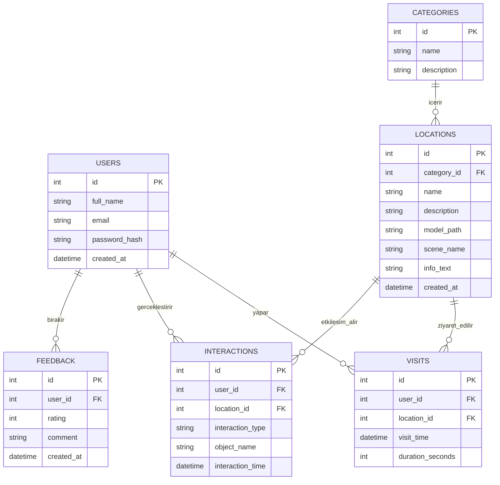

# Veritabanı Tasarımı Dokümanı

## 1. Amaç

Bu doküman, **Sanal Şehir Keşfi** projesi için planlanan veritabanı yapısını tanımlamak amacıyla hazırlanmıştır. Uygulamada kullanılacak temel tablolar, bu tablolar arasındaki ilişkiler ve tutulacak veri alanları burada açıklanmıştır.

Veritabanı tasarımının amacı; kullanıcı bilgilerini, sanal mekan verilerini, etkileşim kayıtlarını ve geri bildirimleri düzenli bir yapıda saklamak, uygulamanın gelecekte genişletilmesini kolaylaştırmak ve veri bütünlüğünü sağlamaktır.

---

## 2. Veritabanı Yaklaşımı

Projenin ilk sürümünde ilişkisel bir veritabanı yapısı önerilmektedir. Bu yapı sayesinde:

- Veriler düzenli tablolar halinde tutulabilir.
- Tablolar arası ilişkiler açıkça tanımlanabilir.
- Veri tekrarının önüne geçilebilir.
- İleride yeni özellikler eklendiğinde sistem daha kolay genişletilebilir.

Bu proje için **SQLite**, **MySQL** veya **PostgreSQL** gibi ilişkisel veritabanı sistemleri kullanılabilir. Geliştirme ve prototip aşaması için SQLite daha pratik bir tercih olabilir.

---

## 3. Temel Gereksinimler

Uygulamanın veritabanında aşağıdaki bilgilerin tutulması planlanmaktadır:

- Kullanıcı bilgileri
- Şehirde yer alan mekanlar ve yapılar
- Mekan kategorileri
- Kullanıcıların ziyaret ettiği mekanlar
- Kullanıcı etkileşim kayıtları
- Kullanıcı geri bildirimleri

---

## 4. Tablolar

## 4.1. Users Tablosu

Bu tablo, uygulamayı kullanan kullanıcıların temel bilgilerini tutar.

| Alan Adı | Veri Tipi | Açıklama |
|---|---|---|
| id | INT / UUID | Birincil anahtar |
| full_name | VARCHAR(100) | Kullanıcının adı soyadı |
| email | VARCHAR(100) | Kullanıcı e-posta adresi |
| password_hash | VARCHAR(255) | Şifrelenmiş parola |
| created_at | DATETIME | Kayıt tarihi |

### Not
İlk prototipte giriş sistemi yoksa bu tablo basitleştirilebilir veya geçici olarak test verileri ile kullanılabilir.

---

## 4.2. Categories Tablosu

Bu tablo, mekanların kategorilerini tutar.

| Alan Adı | Veri Tipi | Açıklama |
|---|---|---|
| id | INT | Birincil anahtar |
| name | VARCHAR(100) | Kategori adı |
| description | TEXT | Kategori açıklaması |

### Örnek Kategoriler
- Tarihi Yapılar
- Kültürel Mekanlar
- Doğal Alanlar
- Müzeler

---

## 4.3. Locations Tablosu

Bu tablo, sanal şehir içerisindeki mekanları veya gezilebilir alanları tutar.

| Alan Adı | Veri Tipi | Açıklama |
|---|---|---|
| id | INT | Birincil anahtar |
| category_id | INT | Categories tablosuna yabancı anahtar |
| name | VARCHAR(150) | Mekan adı |
| description | TEXT | Mekan açıklaması |
| model_path | VARCHAR(255) | 3D model dosya yolu |
| scene_name | VARCHAR(100) | Unity sahne adı |
| info_text | TEXT | Kullanıcıya gösterilecek açıklama |
| created_at | DATETIME | Eklenme tarihi |

### Açıklama
Her mekan bir kategoriye bağlıdır. Böylece kullanıcılar mekanları türüne göre filtreleyebilir veya listeleyebilir.

---

## 4.4. Visits Tablosu

Bu tablo, kullanıcıların hangi mekanları ziyaret ettiğini kayıt altına alır.

| Alan Adı | Veri Tipi | Açıklama |
|---|---|---|
| id | INT | Birincil anahtar |
| user_id | INT | Users tablosuna yabancı anahtar |
| location_id | INT | Locations tablosuna yabancı anahtar |
| visit_time | DATETIME | Ziyaret zamanı |
| duration_seconds | INT | Mekanda geçirilen süre |

### Açıklama
Bu tablo sayesinde kullanıcı davranışları analiz edilebilir. Hangi mekanların daha çok ziyaret edildiği veya kullanıcıların bir mekanda ne kadar vakit geçirdiği görülebilir.

---

## 4.5. Interactions Tablosu

Bu tablo, kullanıcıların uygulama içindeki etkileşimlerini tutar.

| Alan Adı | Veri Tipi | Açıklama |
|---|---|---|
| id | INT | Birincil anahtar |
| user_id | INT | Users tablosuna yabancı anahtar |
| location_id | INT | Locations tablosuna yabancı anahtar |
| interaction_type | VARCHAR(100) | Etkileşim türü |
| object_name | VARCHAR(150) | Etkileşime girilen nesne adı |
| interaction_time | DATETIME | Etkileşim zamanı |

### Örnek Etkileşim Türleri
- bilgi_noktasi_acma
- obje_inceleme
- mekan_secme
- sahne_gecisi

---

## 4.6. Feedback Tablosu

Bu tablo, kullanıcı deneyimi sonrasında verilen geri bildirimleri tutar.

| Alan Adı | Veri Tipi | Açıklama |
|---|---|---|
| id | INT | Birincil anahtar |
| user_id | INT | Users tablosuna yabancı anahtar |
| rating | INT | 1-5 arası puan |
| comment | TEXT | Kullanıcı yorumu |
| created_at | DATETIME | Geri bildirim tarihi |

### Açıklama
Bu tablo, kullanıcı memnuniyetini ölçmek ve uygulamayı geliştirmek için kullanılacaktır.

---

## 5. Tablolar Arası İlişkiler

Veritabanındaki temel ilişkiler aşağıdaki gibidir:

- Bir **kategori**, birden fazla **mekana** sahip olabilir.
- Bir **kullanıcı**, birden fazla **ziyaret** kaydına sahip olabilir.
- Bir **mekan**, birden fazla **ziyaret** kaydına sahip olabilir.
- Bir **kullanıcı**, birden fazla **etkileşim** gerçekleştirebilir.
- Bir **mekan**, birden fazla **etkileşim** kaydına sahip olabilir.
- Bir **kullanıcı**, birden fazla **geri bildirim** bırakabilir.

---

## 6. ER Diyagramı



---

## 7. Şema Özeti

Aşağıdaki yapı önerilmektedir:

- **Users** → kullanıcı bilgileri
- **Categories** → mekan kategorileri
- **Locations** → sanal şehir içindeki mekanlar
- **Visits** → kullanıcı ziyaret kayıtları
- **Interactions** → kullanıcı etkileşim kayıtları
- **Feedback** → kullanıcı geri bildirimleri

---

## 8. SQL Şema Örneği

Aşağıdaki SQL örnekleri temel tablo yapısını göstermektedir:

```sql
CREATE TABLE users (
    id INTEGER PRIMARY KEY AUTOINCREMENT,
    full_name VARCHAR(100) NOT NULL,
    email VARCHAR(100) UNIQUE NOT NULL,
    password_hash VARCHAR(255) NOT NULL,
    created_at DATETIME DEFAULT CURRENT_TIMESTAMP
);

CREATE TABLE categories (
    id INTEGER PRIMARY KEY AUTOINCREMENT,
    name VARCHAR(100) NOT NULL,
    description TEXT
);

CREATE TABLE locations (
    id INTEGER PRIMARY KEY AUTOINCREMENT,
    category_id INTEGER NOT NULL,
    name VARCHAR(150) NOT NULL,
    description TEXT,
    model_path VARCHAR(255),
    scene_name VARCHAR(100),
    info_text TEXT,
    created_at DATETIME DEFAULT CURRENT_TIMESTAMP,
    FOREIGN KEY (category_id) REFERENCES categories(id)
);

CREATE TABLE visits (
    id INTEGER PRIMARY KEY AUTOINCREMENT,
    user_id INTEGER NOT NULL,
    location_id INTEGER NOT NULL,
    visit_time DATETIME DEFAULT CURRENT_TIMESTAMP,
    duration_seconds INTEGER,
    FOREIGN KEY (user_id) REFERENCES users(id),
    FOREIGN KEY (location_id) REFERENCES locations(id)
);

CREATE TABLE interactions (
    id INTEGER PRIMARY KEY AUTOINCREMENT,
    user_id INTEGER NOT NULL,
    location_id INTEGER NOT NULL,
    interaction_type VARCHAR(100) NOT NULL,
    object_name VARCHAR(150),
    interaction_time DATETIME DEFAULT CURRENT_TIMESTAMP,
    FOREIGN KEY (user_id) REFERENCES users(id),
    FOREIGN KEY (location_id) REFERENCES locations(id)
);

CREATE TABLE feedback (
    id INTEGER PRIMARY KEY AUTOINCREMENT,
    user_id INTEGER NOT NULL,
    rating INTEGER CHECK (rating >= 1 AND rating <= 5),
    comment TEXT,
    created_at DATETIME DEFAULT CURRENT_TIMESTAMP,
    FOREIGN KEY (user_id) REFERENCES users(id)
);
```

---

## 9. Önerilen Geliştirmeler

İlerleyen aşamalarda aşağıdaki tablolar da eklenebilir:

- **Admins**: yönetici kullanıcılar
- **Achievements**: kullanıcı başarımları
- **Favorites**: favori mekanlar
- **Media**: mekanlara ait görsel veya ses dosyaları
- **QuizResults**: kullanıcıların bilgi testleri veya mini görev sonuçları

---

## 10. Tasarım Kararları

Bu veritabanı tasarımında şu kararlar dikkate alınmıştır:

- Veri tekrarını azaltmak için kategoriler ayrı tabloda tutulmuştur.
- Kullanıcı davranışlarını analiz edebilmek için ziyaret ve etkileşim tabloları ayrılmıştır.
- Geri bildirim yapısı bağımsız tutulmuştur.
- İlk sürümde sade ama geliştirilebilir bir yapı hedeflenmiştir.

---

## 11. Sonuç

Sanal Şehir Keşfi projesi için önerilen bu veritabanı tasarımı, uygulamanın temel veri ihtiyaçlarını karşılayacak şekilde planlanmıştır. Kullanıcılar, mekanlar, ziyaretler, etkileşimler ve geri bildirimler düzenli bir ilişkisel yapı ile saklanacaktır.

Bu tasarım, projenin ilk sürümü için yeterli bir temel oluşturmakta olup, ilerleyen geliştirme aşamalarında yeni tablolar ve alanlarla genişletilebilir.
